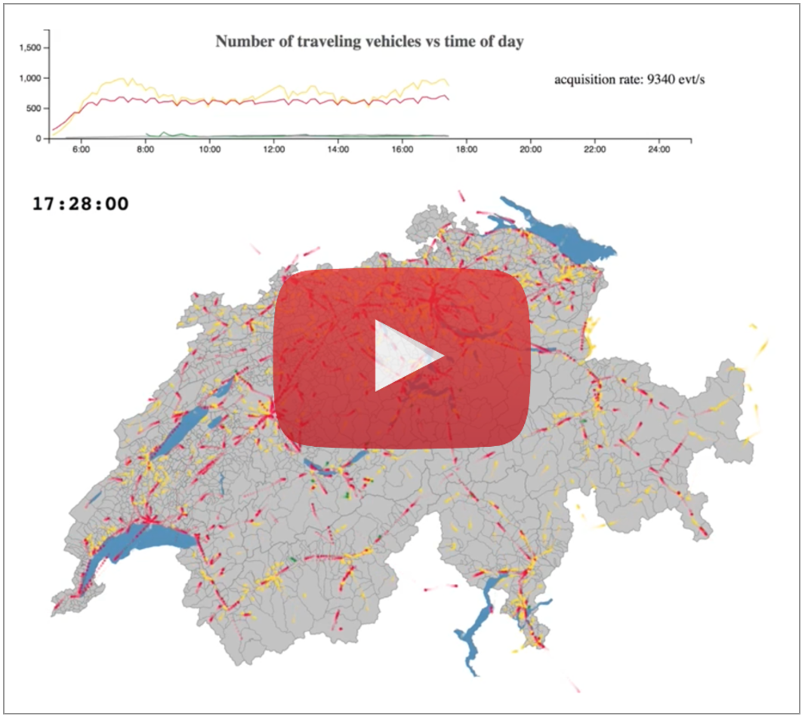

# GTFS-simulation-web

The application reads gtfs transport schedule data from an unzipped directory and serve them via a REST API.
The play/scala source code in this repository handle the backend application, although the packageed archived contains both sback and front end components..

A [blog](http://blog.octo.com/en/visualizing-mass…ansport-use-case/) post explains the whole story

Enjoy!

## Download and unzip gtfs data

## Packaged distribution

You just want to run the app?
Hopefully, an archive has been packaged, with the REST backend and the JavaScript application.
You only need Java 8 installed.

Download the latest zip archive from [here](https://extranet.octo.com/oft/viewfile.php?fileid=71623db0bdec22e94a901e378afc217f) and unzip it.
From within the extracted directory:

    #linux/mac
    bin/gtfs-simulation-play

    #windows
    bin/gtfs-simulation-play.bat

With large data, such as the full Swiss schedule for one year, it can take up to 2.5 minutes to start on a Macbok pro.
Then head to http://localhost:9000 and enjoy!

### Other data

If it also possible to download your own  gtfs schedule or change the selected schedule day.
Being focus on Switzerland by the JavaScript application,
head to http://gtfs.geops.ch/ and download one of the feeds
(either the *complete* set or a more tailored)Unzip it into a directory (*e.g.* $HOME/tmp/gtfs/)

    bin/gtfs-simulation-play              \
    -Dschedule.gtfs.path=$HOME/tmp/gtfs/  \
    -Dschedule.date=20170213

## Development

### code & run

Unzip a (http://gtfs.geops.ch/) archive in `data/gtfs_complete (or modify conf/application.conf if you set it up elsewhere)

The stack uses activator

    ./activator ~run
    ./activator ~test

### Distribution

A packaged zip is built in `target/universal`. This is the file to be downloaded in the previously mentioned link

    ./activator dist

### Continuous buid

SImply with travis https://travis-ci.org/alexmasselot/gtfs-simulation-play

##Author

Alexandre Masselot amasselot@octo.com

## License & third parties

This work is covered by a BSD license. Use it as you wish.

### Third parties

Of course, we user mainy third parties components. Among others, the packaged distributions includes

  * GTFS swiss schedule http://gtfs.geops.ch/
  * topojson Swiss map https://github.com/interactivethings/swiss-maps
  * Activator/play http://www.lightbend.com/community/core-tools/activator-and-sbt
  * Scala, d3.js, nodejs...

Many thanks to all of them

